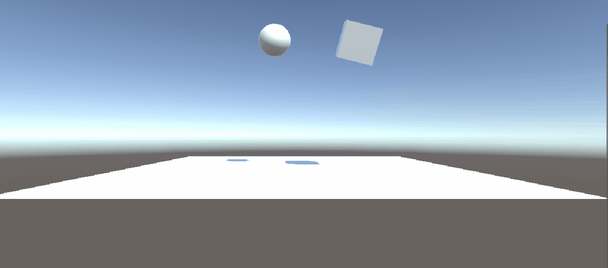
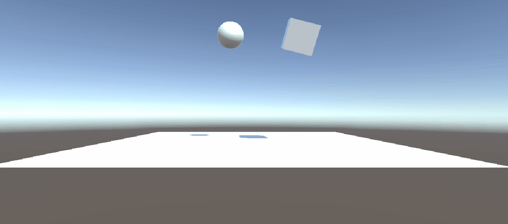

# Interfaces Inteligentes - Práctica 2 - Scripts
## Fabio Bianchini Cano

Ejercicio 1. Cubo, esfera y plano con diferentes configuraciones.

1. Ninguno de los objetos será físico.
   
    
2. La esfera tiene físicas, el cubo no.

    
3. La esfera y el cubo tienen físicas.

    
4. La esfera y el cubo son físicos y la esfera tiene 10 veces la masa del cubo.

    
5. La esfera tiene físicas y el cubo es de tipo IsTrigger.

    
6. La esfera tiene físicas y el cubo es de tipo IsTrigger y tiene físicas.

    
7. La esfera y el cubo son físicos y la esfera tiene 10 veces la masa del cubo, se impide la rotación del cubo sobre el plano XZ.

    