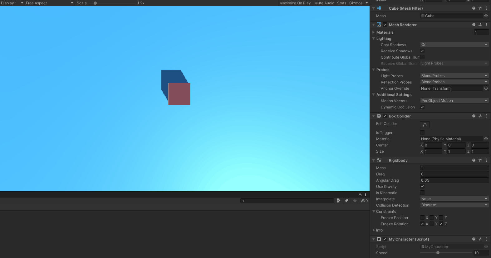
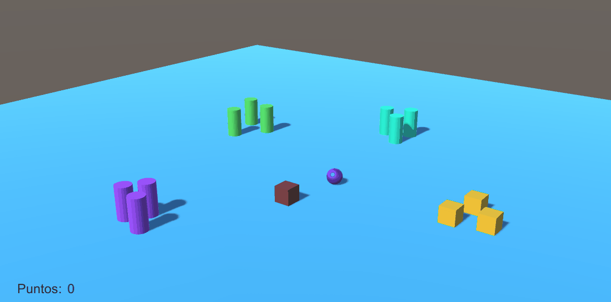
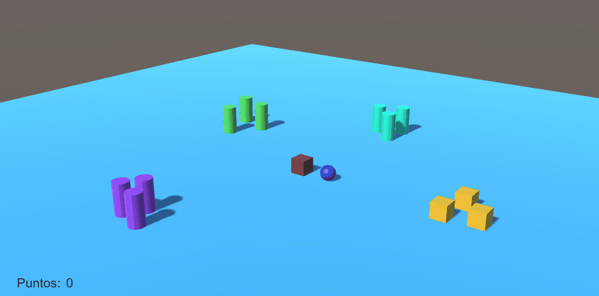
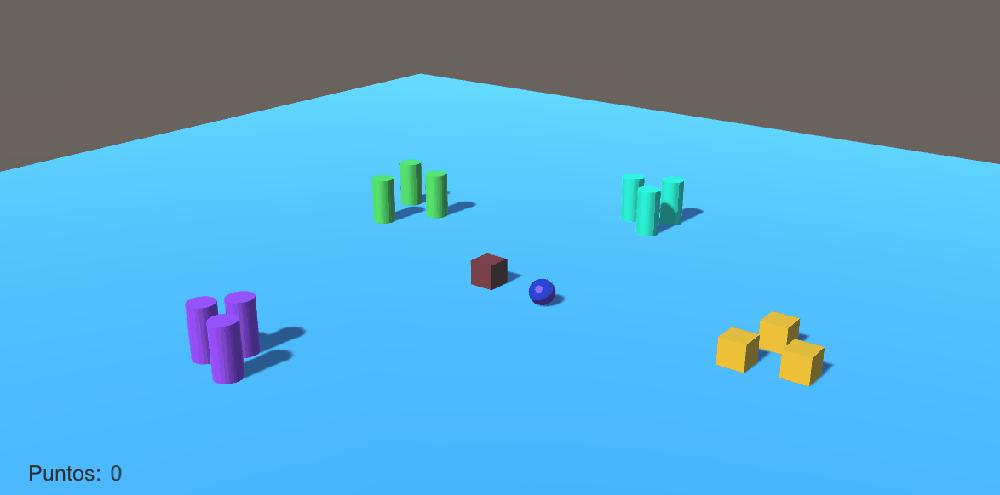

# Interfaces Inteligentes - Práctica 2 - Scripts
## Fabio Bianchini Cano

### Ejercicio 1. Cubo, esfera y plano con diferentes configuraciones.

  1. Ninguno de los objetos será físico.
    
      
  2. La esfera tiene físicas, el cubo no.

      
  3. La esfera y el cubo tienen físicas.

      
  4. La esfera y el cubo son físicos y la esfera tiene 10 veces la masa del cubo.

      
  5. La esfera tiene físicas y el cubo es de tipo IsTrigger.

      
  6. La esfera tiene físicas y el cubo es de tipo IsTrigger y tiene físicas.

      
  7. La esfera y el cubo son físicos y la esfera tiene 10 veces la masa del cubo, se impide la rotación del cubo sobre el plano XZ.

      

### Ejercicio 2. Character Controller.

  Se ha agregado un script que controla el movimiento del cubo, que representa a nuestro jugador.

  Mediante un barra deslizante en el inspector de objetos modificamos el valor de la velocidad del mismo, en tiempo real.

  

  
  También implementado con rotaciones

  

### Ejercicio 3
Para el ejercicio 3 en la escena se añaden varios tipos de objetos que interaccionan con el jugador de diversas maneras.

- Cilindros que aumentan su tamaño y la puntuación del jugador.

    
- Cilindros que cuando el jugador pulsa el espacio y está lo suficientemente cerca, se les a la dirección opuesta.

    
- Cilindros que huyen del jugador.

    
- Segundo jugador representado por una esfera que se mueva con las teclas *IJKL*.

    
- Cubos que cuando el jugador principal los toca, disminuyen su tamaño, y si los toca el jugador secundario, aumentan.

    